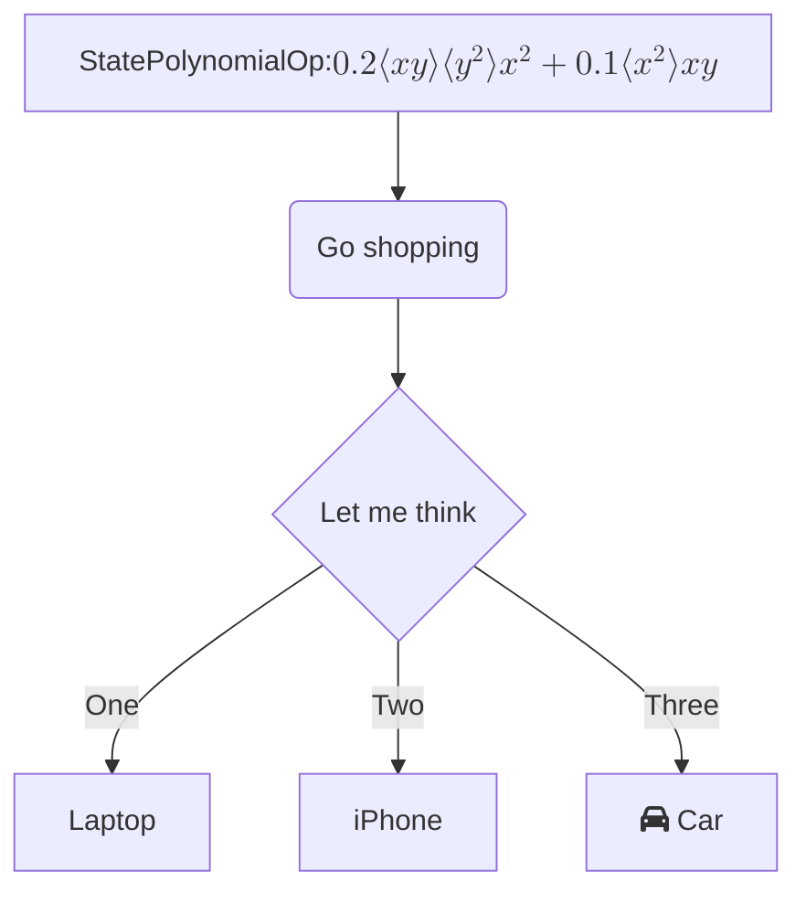

# State Polynomial Structure

```mermaid
graph TD
    A[StatePolynomialOp: $$0.2 \langle xy \rangle \langle y^2 \rangle x^2 + 0.1 \langle x^2 \rangle xy$$] --> B(Go shopping)
    B --> C{Let me think}
    C -->|One| D[Laptop]
    C -->|Two| E[iPhone]
    C -->|Three| F[fa:fa-car Car]
```