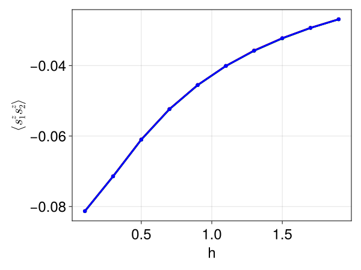

# [Certifying Ground State Properties](@id certify-property)

Understanding the ground-state properties of quantum many-body systems is a
**ubiquitous and central problem in quantum physics**
[wang2024Certifying](@cite), critical for comprehending the low-energy phases
and genuine quantum correlation properties of these systems. However, precisely
determining these properties presents a formidable challenge. A brute-force
approach, involving the exact diagonalization of the Hamiltonian, becomes
computationally impossible beyond small clusters of particles because the
Hilbert space dimension grows exponentially with the number of particles. This
exponential scaling makes the exact enumeration of ground-state coefficients
unfeasible, necessitating the use of approximation methods that offer better
computational scaling.

However, we may bound the properties of a system using a combination of
variational methods and relaxations. Firstly, variational methods can provide
upper bounds on the ground-state energy, while relaxations, particularly those
based on semidefinite programming (SDP), can offer lower bounds. For
demonstration purpose, we will replace the variational method with Exact Diagonalization on a quantum Heisenberg model

$$\hat{H} = J \sum_{j=1}^{N}\sigma^z_j \sigma^z_{j+1} + h \sum_{j=1}^{N} \sigma^x_j$$

```julia
using Yao
using LinearAlgebra

N = 3
J = 1.0

ground_state_energy_upper_bounds = Float64[]
s1s2values = Float64[]

for h in 0.1:0.2:2.0
    ham = sum(J / 4 * kron(N, i => Z, mod1(i + 1, N) => Z) for i in 1:N) + sum(h / 2 * put(N, i => X) for i in 1:N)

    evals, eigves = eigen(Matrix(ham))

    s1s2 = Matrix(kron(N, 1 => Z, 2 => Z)) / 4
    push!(ground_state_energy_upper_bounds, minimum(real(evals)) / N)
    push!(s1s2values, real(eigves[:, argmin(real(evals))]' * s1s2 * eigves[:, argmin(real(evals))]))
end
```

Next, we can obtain ground state energy lower bounds obtained from `NCTSSoS.jl`.

```julia
using NCTSSoS, NCTSSoS.FastPolynomials
using MosekTools
using JuMP

SOLVER = optimizer_with_attributes(Mosek.Optimizer, "MSK_DPAR_INTPNT_CO_TOL_PFEAS" => 1e-8, "MSK_DPAR_INTPNT_CO_TOL_DFEAS" => 1e-8, "MSK_DPAR_INTPNT_CO_TOL_REL_GAP" => 1e-8, "MSK_IPAR_NUM_THREADS" => 0)

ground_state_energy_lower_bounds = Float64[]

N = 3
T1 = ComplexF64
J = 1.0
for (i, h) in enumerate(0.1:0.2:2.0)

     @ncpolyvar x[1:N] y[1:N] z[1:N]

     obj = one(T1) * z[1] * z[2]

     ham = sum(T1(J / 4) * z[i] * z[mod1(i + 1, N)] + T1(h / 2) * x[i] for i in 1:N)

     eq_cons = reduce(vcat, [[x[i] * y[i] - im * z[i], y[i] * x[i] + im * z[i], y[i] * z[i] - im * x[i], z[i] * y[i] + im * x[i], z[i] * x[i] - im * y[i], x[i] * z[i] + im * y[i]] for i in 1:N])

     pop = cpolyopt(ham; eq_constraints=eq_cons, comm_gps=[[x[i], y[i], z[i]] for i in 1:N], is_unipotent=true)

     solver_config = SolverConfig(optimizer=SOLVER, order=2)

	 res = cs_nctssos(pop, solver_config)

	 push!(ground_state_energy_lower_bounds, res.objective / N)
end
```

Finally, we can also bound other ground state properties, such as the expectation value of $S^z_{i}S^z_{i+1}$.

```julia
function cs_nctssos_with_entry(pop::OP, solver_config::SolverConfig, entry_constraints::Vector{Polynomial{T}}; dualize::Bool=true) where {T,P<:Polynomial{T},OP<:NCTSSoS.OptimizationProblem{P}}

   sa = SimplifyAlgorithm(comm_gps=pop.comm_gps, is_projective=pop.is_projective, is_unipotent=pop.is_unipotent)
   order = iszero(solver_config.order) ? maximum([ceil(Int, maxdegree(poly) / 2) for poly in [pop.objective; pop.eq_constraints; pop.ineq_constraints]]) : solver_config.order

   corr_sparsity = NCTSSoS.correlative_sparsity(pop, order, solver_config.cs_algo)

   cliques_objective = [reduce(+, [issubset(sort!(variables(mono)), clique) ? coef * mono : zero(coef) * one(mono) for (coef, mono) in zip(coefficients(pop.objective), monomials(pop.objective))]) for clique in corr_sparsity.cliques]

   initial_activated_supps = map(zip(cliques_objective, corr_sparsity.clq_cons, corr_sparsity.clq_mom_mtx_bases)) do (partial_obj, cons_idx, mom_mtx_base)
        NCTSSoS.init_activated_supp(partial_obj, corr_sparsity.cons[cons_idx], mom_mtx_base, sa)
   end

   cliques_term_sparsities = map(zip(initial_activated_supps, corr_sparsity.clq_cons, corr_sparsity.clq_mom_mtx_bases, corr_sparsity.clq_localizing_mtx_bases)) do (init_act_supp, cons_idx, mom_mtx_bases, localizing_mtx_bases)
        NCTSSoS.term_sparsities(init_act_supp, corr_sparsity.cons[cons_idx], mom_mtx_bases, localizing_mtx_bases, solver_config.ts_algo, sa)
   end

   moment_problem = NCTSSoS.moment_relax(pop, corr_sparsity, cliques_term_sparsities)

   for c in entry_constraints
       push!(moment_problem.constraints,(:HPSD, [c;;]))
   end

   (pop isa NCTSSoS.ComplexPolyOpt{P} && !dualize) && error("Solving Moment Problem for Complex Poly Opt is not supported")
   problem_to_solve = !dualize ? moment_problem : NCTSSoS.sos_dualize(moment_problem)

   set_optimizer(problem_to_solve.model, solver_config.optimizer)
   optimize!(problem_to_solve.model)
   return NCTSSoS.PolyOptResult(objective_value(problem_to_solve.model), corr_sparsity, cliques_term_sparsities, problem_to_solve.model)
end
```

```julia
# this is supposed to be upper bounds because it's from DMRG
energy_lower_bounds = [
     -0.11892547876100075,
     -0.1999999999999994,
     -0.288675134594812,
     -0.38134355029701733,
     -0.47627352424814867,
     -0.5725815626252594,
     -0.6697825646477007,
     -0.7675918792439959,
     -0.8658328118479361,
     -0.9643904066487076]

energy_upper_bounds = Float64[
     -0.11892547875898078,
     -0.19999999979682634,
     -0.2886751335933035,
     -0.3813435496845692,
     -0.47627352422295716,
     -0.5725815625410057,
     -0.6697825646314844,
     -0.7675918790994536,
     -0.8658328114858912,
     -0.9643904052079089
]

s1s2vals = [
     -0.08130486019121048,
     -0.07142857142857142,
     -0.06100423396407306,
     -0.05235872373966302,
     -0.04551650597210013,
     -0.04010214944192127,
     -0.03576253848356316,
     -0.0322292075469226,
     -0.029307555889062215,
     -0.026857181875325212
]

lower_bounds = Float64[]
upper_bounds = Float64[]

J = 1.0
for (i, h) in enumerate(0.1:0.2:2.0)

     @ncpolyvar x[1:N] y[1:N] z[1:N]

     obj = one(T1) * z[1] * z[2]

     ham = sum(T1(J / 4) * z[i] * z[mod1(i + 1, N)] + T1(h / 2) * x[i] for i in 1:N)

     eq_cons = reduce(vcat, [[x[i] * y[i] - im * z[i], y[i] * x[i] + im * z[i], y[i] * z[i] - im * x[i], z[i] * y[i] + im * x[i], z[i] * x[i] - im * y[i], x[i] * z[i] + im * y[i]] for i in 1:N])

     ineq_cons = [ham - energy_lower_bounds[i] * N]

     pop_l = cpolyopt(obj; eq_constraints=eq_cons, ineq_constraints=ineq_cons, comm_gps=[[x[i], y[i], z[i]] for i in 1:N], is_unipotent=true)

     pop_u = cpolyopt(-obj; eq_constraints=eq_cons, ineq_constraints=ineq_cons, comm_gps=[[x[i], y[i], z[i]] for i in 1:N], is_unipotent=true)

     solver_config = SolverConfig(optimizer=SOLVER, order=2)

     single_ineq_cons = [energy_upper_bounds[i] * N - ham]

     res_l = cs_nctssos_with_entry(pop_l, solver_config, single_ineq_cons; dualize=true)
     res_u = cs_nctssos_with_entry(pop_u, solver_config, single_ineq_cons; dualize=true)

     push!(lower_bounds, res_l.objective / 4)
     push!(upper_bounds, -res_u.objective / 4)
end
```

```julia
lower_bounds
```

```julia
10-element Vector{Float64}:
 -0.081326521802045
 -0.07144494615022218
 -0.061031951331368385
 -0.05237691094290013
 -0.045556960025467906
 -0.040107511949211805
 -0.035801407640543494
 -0.03228955861752344
 -0.029320907361403938
 -0.026874062060473675
```

```julia
upper_bounds
```

```julia
10-element Vector{Float64}:
 -0.08129752400936514
 -0.07141219980127045
 -0.06097644357642557
 -0.05232899660339053
 -0.04551280266513945
 -0.04009470216851507
 -0.035718972816220225
 -0.032220913943863456
 -0.029289163094941454
 -0.02684018654212973
```

```julia
using CairoMakie

s1s2vals = [
     -0.08130486019121048,
     -0.07142857142857142,
     -0.06100423396407306,
     -0.05235872373966302,
     -0.04551650597210013,
     -0.04010214944192127,
     -0.03576253848356316,
     -0.0322292075469226,
     -0.029307555889062215,
     -0.026857181875325212
]

lower_bounds = [
 -0.081326521802045,
 -0.07144494615022218,
 -0.061031951331368385,
 -0.05237691094290013,
 -0.045556960025467906,
 -0.040107511949211805,
 -0.035801407640543494,
 -0.03228955861752344,
 -0.029320907361403938,
 -0.026874062060473675
]

upper_bounds = [
 -0.08129752400936514,
 -0.07141219980127045,
 -0.06097644357642557,
 -0.05232899660339053,
 -0.04551280266513945,
 -0.04009470216851507,
 -0.035718972816220225,
 -0.032220913943863456,
 -0.029289163094941454,
 -0.02684018654212973
]

f = Figure()
Axis(f[1, 1],xlabel="h",ylabel=L"\langle s^z_1 s^z_2 \rangle")

xs = collect(0.1:0.2:2.0) 

scatterlines!(xs, upper_bounds, color = :red)
scatterlines!(xs, lower_bounds, color = :green)
scatterlines!(xs, s1s2vals, color = :blue)

f
```




