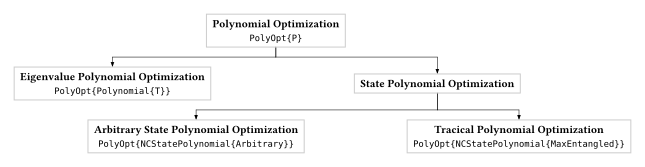

# [Polynomials in Non-Commutative Optimization](@id polynomials)

`NCTSSoS.jl` is designed to solve optimization problems where the variables do
not commute, a scenario that is the foundation of quantum mechanics. This page
outlines the key polynomial types used in the package and their specific
applications in many-body physics.



## [Non-Commutative Polynomials: The Language of Quantum Systems](@id non-commutative-polynomial)

In quantum mechanics, the order of measurements matters. Non-commutative
polynomials provide the natural language for this reality. They are the building
blocks for constructing the **Hamiltonian** of a quantum system, which describes
its total energy.

## [Trace Polynomials: Probing Non-Local Correlations](@id tracial-polynomial)

Trace polynomials are a specialized class of mathematical objects that consist
of polynomials in noncommuting variables combined with traces of their products.
Unlike ordinary commutative polynomials where variables can be freely rearranged
(e.g., xy = yx), trace polynomials involve noncommutative variables where order
matters, and they incorporate the trace operation—a fundamental concept from
linear algebra and operator theory that computes the sum of diagonal elements of
a matrix. These mathematical structures have gained significant attention due to
their applications in quantum information theory, particularly in the context of
optimizing quantum systems and analyzing violations of polynomial Bell
inequalities. The optimization of trace polynomials subject to tracial
constraints represents a natural extension of semidefinite programming
techniques to the noncommutative setting, drawing from areas such as real
algebraic geometry, operator theory, and noncommutative algebra to provide
powerful tools for solving complex problems in quantum mechanics and related
fields.

## Mathematical Framework

In the context of tracial polynomial optimization, we consider polynomials of the form:

```
p(X₁, X₂, ..., Xₙ) = Σ cₐ tr(Xₐ)
```

where:
- `X₁, X₂, ..., Xₙ` are noncommuting matrix variables
- `cₐ` are real coefficients
- `Xₐ` represents monomials in the noncommuting variables
- `tr(·)` denotes the trace operation

The key challenge in tracial polynomial optimization is to find the minimum or maximum value of such polynomials subject to tracial constraints, which may include:
- Trace normalization conditions
- Positivity constraints on trace polynomials
- Additional structural constraints on the matrix variables

## Optimization Hierarchy

The optimization of trace polynomials can be approached through a hierarchy of semidefinite relaxations that converge monotonically to the optimal value. This hierarchy extends classical semidefinite programming techniques to handle the noncommutative nature of the variables and the trace operations involved.

The method involves:
1. **Moment relaxations**: Constructing moment matrices associated with the tracial functionals
2. **Positivstellensatz certificates**: Using algebraic certificates to verify positivity of trace polynomials
3. **GNS construction**: Applying the Gelfand-Naimark-Segal construction to extract optimal solutions when flatness conditions are satisfied

## Applications

Tracial polynomial optimization has found important applications in:

- **Quantum Information Theory**: Optimizing quantum states and operations
- **Bell Inequality Violations**: Analyzing and maximizing violations of polynomial Bell inequalities
- **Quantum Error Correction**: Designing optimal quantum error correction codes
- **Semidefinite Programming**: Extending classical SDP techniques to noncommutative settings

## [State Polynomials: Testing Advanced Quantum Phenomena](@id state-polynomial)

State polynomials are functions of the expectation values themselves. This
structure is essential for defining **nonlinear Bell inequalities**. These more
complex inequalities provide powerful and subtle tests of quantum mechanics,
allowing researchers to explore the boundary between the quantum and classical
worlds in greater detail.

## [Eigenvalue Polynomials: Finding the Energy Spectrum](@id eigenvalue-polynomial)

These polynomials are used to find the possible energy levels (eigenvalues) of a
quantum Hamiltonian. A primary application is to find the **ground state
energy**—the lowest possible energy of a many-body system. This is a fundamental
problem in condensed matter physics and quantum chemistry, with applications in
materials science and drug discovery.
